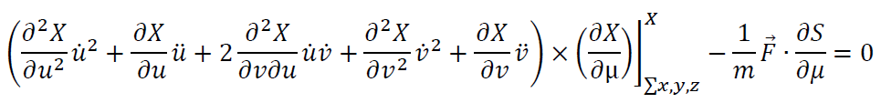
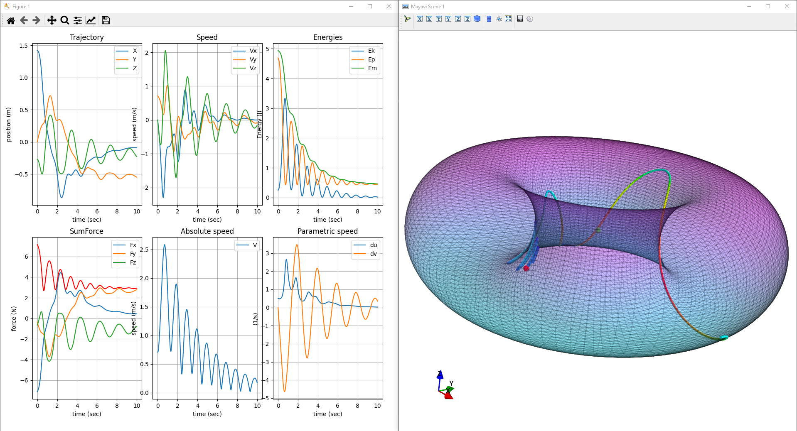
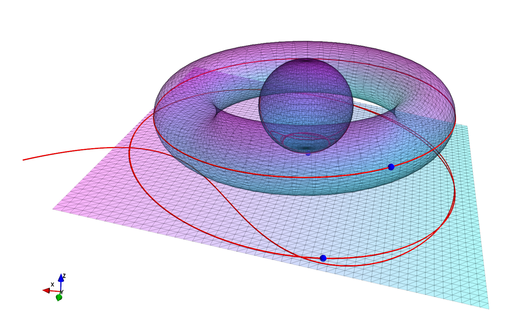
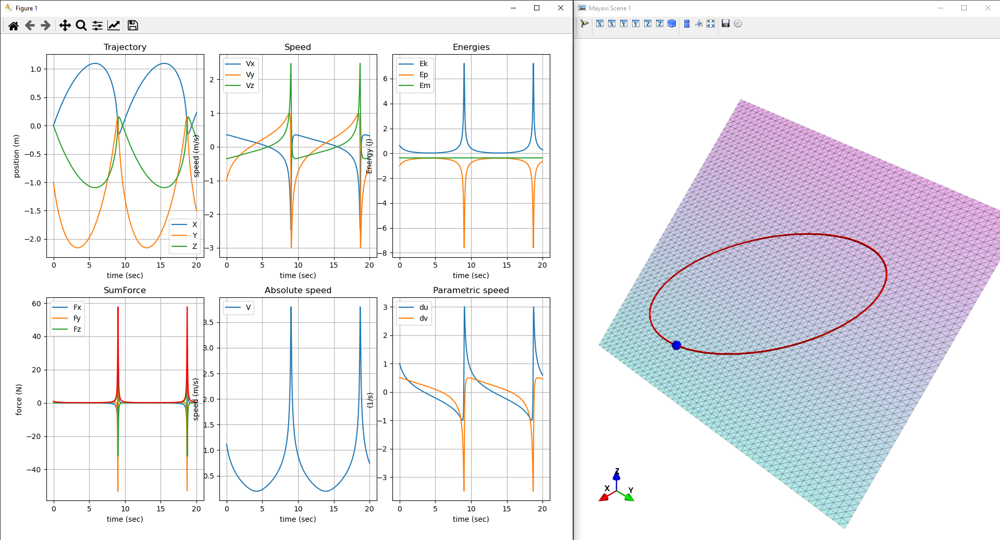

# gsurface library

This library offers tools for simulating and plotting single or structured point mass(es) guided by 2D surfaces according to a the Newton 2nd Law Approach

Following surfaces are defined: Plan, Sphere, Tore, Catenoid, Canonical Corner, Eggbox, Paraboloids + TranslatedSurfaceGenerator, RevolutionSurfaceGenerator

Following forces are defined: Spring, Viscous & Air Friction, (Distance) Gravity, EM forces, SpringDamping, Interactions

Any Surface Force or Model can be implemented over this Library

## Links

### Dev documentation

You can find library documentation here : https://github.com/Adecy/gsurface/blob/master/dev/doc/model.pdf

i.e. : This library basically implements a solver for the following equation : 



Unfortunately in French ...

- pre study : 3D (2019) : https://github.com/Adecy/gsurface/blob/master/dev/doc/guided-3d-2019.pdf
- pre study : 2D (2018) : https://github.com/Adecy/gsurface/blob/master/dev/doc/guided-2d-2018.pdf

### Repository
* https://github.com/Adecy/gsurface

### Documentation
* https://github.com/Adecy/gsurface/doc

## Examples

### Simple tore simulation

Code snippet :

```python
import numpy as np
from mayavi import mlab

from gsurface import SurfaceGuidedMassSystem, SpringForce, Gravity, \
    ViscousFriction, build_s0
from gsurface.indexes import *
from gsurface.plotter import matplotlib_plot_solutions, mayavi_animate_surface_trajectory
from gsurface.surface import Tore

# Model
m = 1.0
system_tore = SurfaceGuidedMassSystem(
    surface=Tore(0.5, 1.0),
    s0=build_s0(u0=0.0, du0=0.5, v0=1.0, dv0=0.0),
    m=m,
    forces=[
        SpringForce(stiffness=5.0, clip=np.array([0.0, 0.0, 0.0])),
        Gravity(m=m, g=np.array([0.0, 0.0, -2.0])),
        # LengthedSpringForce(stiffness=5.0, clip=np.array([1.0, 1.0, 0.0]), l0=1.0),
        ViscousFriction(mu=0.5),
    ]
)

# simulation and plot ...
```
 

### Multiple solid simulation

Code snippet :

```python
import time as timelib

from gsurface.forces import Gravity, ViscousFriction
from gsurface.forces.interaction import OneSideSpringInteraction
from gsurface.imodel import *
from gsurface.indexes import Tyi
from gsurface.model import build_s0
from gsurface.plotter.mayavi import mlab, mayavi_plot_surfaces, SurfacePlot
from gsurface.surface import Sphere, Tore, Plan

# objects
sphere = Sphere(0.8).translate(np.array([0.0, 0.0, 0.0]))
mesh_sphere = sphere.build_surface(*sphere.mesh(50, 50))

tore = Tore(r=0.5, R=2.0).translate(np.array([0.0, 0.0, 0.0]))
mesh_tore = tore.build_surface(*tore.mesh(50, 50))

plan_shift = np.array([0.0, 0.0, -1.0])
plan = Plan.from_xz_rotation(np.pi/2*0.1).translate(plan_shift).setlims(v_ll=-4, v_ul=4, u_ll=-4, u_ul=4)
mesh_plan = plan.build_surface(*plan.mesh(50, 50))

gravity_vector = np.array([0.0, 0.0, -10.0])

tore_sim = SurfaceGuidedMassSystem(
    surface=tore,
    s0=build_s0(v0=np.pi/2, du0=3.0),
    m=1.0
)

sphere_sim = SurfaceGuidedMassSystem(
    surface=sphere,
    s0=build_s0(v0=np.pi/2, dv0=2),
    m=1.0,
    forces=[
        Gravity(1.0, gravity_vector),
        ViscousFriction(1.0)
    ]
)

plan_sim = SurfaceGuidedMassSystem(
    surface=plan,
    s0=build_s0(u0=4.0, v0=2),
    m=1.0,
    forces=[
        ViscousFriction(5),
    ]
)

time = np.linspace(0.0, 10.0, 1000)

joint_sim = SurfaceGuidedInteractedMassSystems([sphere_sim, tore_sim, plan_sim], {
    (1, 0): OneSideSpringInteraction(1.0),
    (1, 2): OneSideSpringInteraction(50.0)
})
```

 

### Planets simulation

Code snippet :

```python
from gsurface import Plan, NewtonGravity, SurfaceGuidedMassSystem, Tyi, build_s0, ViscousFriction
from gsurface.plotter import mayavi_plot_surfaces, SurfacePlot, matplotlib_plot_solutions

import numpy as np

# simulate a planet rotating around a fixed massive system

universe_def = Plan(c=1.0).setlims(u_ul=2.5, v_ul=2)
universe = universe_def.build_surface(*universe_def.mesh(50, 50))

model = SurfaceGuidedMassSystem(
    surface=universe_def,
    s0=build_s0(u0=1.0, dv0=0.5, du0=1.0),
    m=1.0,
    forces=[
        NewtonGravity(m=1.0, M=100.0, G=1.0, clip=np.zeros((3,))),
    ]
)
```



**Code snippets**

## Examples

1. Brachistochrone symetric surface

TODO

2. Twisted brachistochrone surface

TODO

3. Interacted solids on brachistochrone surface

TODO

More examples can be found in the `examples` directory.
